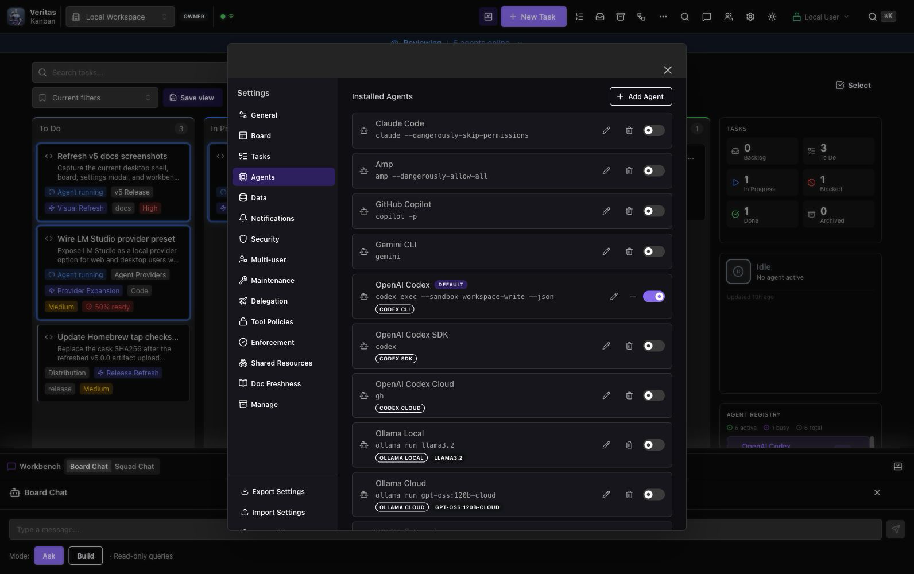

# Agent Providers

Veritas works as a board without any agent runner. When you do enable agents, provider profiles are configured in **Settings -> Agents** and are stored in the same app config for the web app and the macOS desktop app.



## Defaults

Fresh v6 installs use OpenAI Codex as the default agent:

- `codex` is enabled by default and uses `codex exec --sandbox workspace-write --json`.
- `codex-sdk`, `codex-app-server`, `claude-code`, `copilot`, `acp-stdio`, and
  `hermes` have executable adapters but are disabled by default.
- `amp`, `gemini`, `codex-cloud`, `ollama-local`, `ollama-cloud`, and
  `lm-studio-local` remain visible for configuration and migration, but
  they cannot dispatch until a matching executable adapter ships.
- Built-in routing sends code, bug, documentation, and review work to `codex` first, with conservative fallbacks for higher-risk code paths.

Existing configs keep the user's chosen default agent. Missing built-in profiles are added during config normalization without overwriting customized commands, arguments, or enabled states.

## Claude Code v2.1.218

The first-class `claude-code` adapter contract is pinned to Claude Code
v2.1.218. Veritas launches the executable directly in the assigned worktree
with no shell and a reproducible system-owned argument set:

```text
claude --bare --print --output-format stream-json --verbose \
  --include-partial-messages --include-hook-events \
  --forward-subagent-text --permission-mode dontAsk
```

The public Claude Code repository does not contain the complete CLI
implementation. This contract is therefore pinned to the v2.1.218 release,
official CLI/headless documentation, and checked-in golden stream fixtures;
unknown versions invalidate conformance instead of inheriting certification.

The exact launch also disables slash commands and Chrome, caps turns at 100 by
default, applies an optional run cost budget, and derives allowed and denied
tools from the effective sandbox. Read, Glob, and Grep are available in all
sandboxes. Edit and Write require a writable sandbox. Bash requires both a
writable sandbox and network access. WebFetch and WebSearch are denied when
network access is disabled, and sensitive environment, secret, and credential
file patterns are denied. Caller arguments cannot replace these controls,
inherit settings/plugins/MCP configuration, select an unrelated session, or
bypass permissions. Veritas may append system-owned `--resume <session-id>`
and `--fork-session` only after the provider-neutral lifecycle validator binds
the exact source attempt.

`--bare` deliberately skips Claude Code's local settings, plugins, MCP servers,
OAuth, and keychain state. Veritas therefore copies the worktree's `AGENTS.md`
into the attributed task request and requires explicit bare-mode
authentication. Supported credential keys are `ANTHROPIC_API_KEY`,
`ANTHROPIC_AUTH_TOKEN`, `ANTHROPIC_FOUNDRY_API_KEY`,
`ANTHROPIC_FOUNDRY_AUTH_TOKEN`, `AWS_BEARER_TOKEN_BEDROCK`, and the bounded AWS
credential set used for Bedrock. Vertex requires an explicit
`GOOGLE_APPLICATION_CREDENTIALS` file reference. Vertex, Bedrock, and Foundry
selectors are allowlisted separately but do not prove authentication on their
own. Claude Code's subprocess environment scrubbing is forced on so Bash,
hooks, and MCP subprocesses cannot inherit provider credentials. Arbitrary
custom headers, config directories, and unrelated credential-shaped
environment variables are not forwarded.

Readiness runs bounded `claude --version`, `claude auth status`, and
`claude agents --json` probes without a shell. The auth status probe is useful
diagnostic evidence, but only the explicit bare-mode environment satisfies
launch authentication. The runtime profile requires an exact
`2.1.218 (Claude Code)` version match and probe revision 14; version or build
drift invalidates conformance evidence.

Claude's stream is consumed as bounded JSONL. Partial text/thinking, tool
use/results, hooks, subagents, retries, usage/cost, and terminal results map to
the shared causal event journal. The provider `session_id` is stored separately
from turn identity in `run-event/v1` and on the attempt as its continuation
handle. Veritas waits for queued stdout processing and parses the final
unterminated record after process close, preventing the terminal result from
being lost during stream drain. A successful process exit without an
authoritative successful `result` record fails closed.

Resume and follow-up use the exact persisted `session_id`; fork combines
`--resume` with `--fork-session` so the source history is not mutated.
Interactive approvals, elicitation, steering, compaction, and archival remain
explicitly unsupported. Run-scoped MCP injection is supported through a
Veritas-generated `--strict-mcp-config` document and an exact
`--allowedTools` list. Only tools with an `allow` catalog decision are exposed
to Claude; approval-required tools remain available only through the
Veritas-mediated tool-call surface.

Credential-gated release smoke is opt-in:

```bash
VERITAS_CLAUDE_CODE_SMOKE=1 pnpm --filter @veritas-kanban/server exec vitest run \
  src/__tests__/claude-code-provider.smoke.test.ts
```

The smoke requires the exact certified executable and explicit bare-mode
authentication. It runs one read-only, network-disabled, one-turn request with
a $0.25 provider cap and verifies the authoritative result record. The normal
test suite skips it.

## OpenAI Codex app-server v0.145.0

Veritas supports three distinct Codex execution roles:

- `codex-cli` remains the one-shot `codex exec --json` adapter.
- `codex-sdk` remains the in-process SDK adapter.
- `codex-app-server` is the supervised interactive JSON-RPC v2 adapter.

The app-server adapter is pinned to `codex-cli 0.145.0`, upstream tag
`rust-v0.145.0`, commit
`25af12f7e61572b0bc18ddb1008be543b91519b0`. Its checked-in schemas were
generated by that exact executable. The certified generated schema-set digest is
`b59f4df6df8d00b3e665b533416efcfef9b5530bcd22a1e4a15dfe7bbd3a8624`.
Version or build drift invalidates conformance evidence at provider probe
revision 12.

Veritas owns the launch:

```text
codex app-server --stdio --strict-config \
  -c mcp_servers={} -c hooks={} \
  --disable plugins --disable apps \
  --disable in_app_browser --disable computer_use \
  --disable tool_call_mcp_elicitation
```

The process starts without a shell in the assigned task worktree. The safe
Codex environment preserves the normal authentication context and operator
allowlist while forcing
`CODEX_INTERNAL_APP_SERVER_REMOTE_CONTROL_DISABLED=1`. Live certification
requires the app-server to report remote-control status `disabled`.

The outbound method allowlist contains `initialize`, thread
start/resume/fork/compact/archive, and turn start/steer/interrupt. Veritas
initializes once, binds one task attempt to an exact thread and active turn,
persists thread/turn/item identity, validates every consumed request, response,
notification, and provider request, and maps streamed items, usage, file
changes, and authoritative `turn/completed` into the causal run journal and
completion contract. JSONL records are capped at 4 MiB. Uncorrelated or
schema-invalid records fail closed. Documented overload error `-32001` receives
bounded exponential backoff.

The upstream `thread/shellCommand` method runs unsandboxed and is structurally
unreachable from Veritas. Command, file-change, permission, legacy exec/patch,
tool-question, and MCP elicitation requests enter the durable
`run-approval/v1` broker. The exact action is hashed, the provider waits for one
authenticated compare-and-set decision, and the adapter sends a response
validated against the pinned method-specific schema. Rejection, expiry,
interruption, cancellation, stale evidence, and response errors fail closed.
Only tool questions are marked mobile-safe by this adapter; shell, filesystem,
network, permission, and MCP requests require a non-mobile reviewer.

Resume, follow-up, steer, fork, compact, archive, close, and crash reattachment
are capability-gated against the immutable runtime evidence. Native history
forks retain the parent conversation and optional source-turn boundary without
mutating the source. Inherited MCP servers, plugins, apps, hooks,
browser/computer tools, and remote control remain disabled. When a profile
selects MCP definitions, Veritas passes only the immutable run catalog as
thread-scoped `mcp_servers` configuration. Approval-required tools are disabled
in native configuration and must use the mediated tool-call surface.

Credential-gated release smoke is opt-in:

```bash
VERITAS_CODEX_APP_SERVER_SMOKE=1 pnpm --filter @veritas-kanban/server exec vitest run \
  src/__tests__/codex-app-server-provider.smoke.test.ts
```

The smoke requires the exact authenticated v0.145.0 executable, runs one
read-only task-bound turn, verifies the authoritative completion text, and
confirms remote control remains disabled. The normal test suite skips it.

## ACP stdio agent provider

The `acp-stdio` provider is the generic stable Agent Client Protocol v1 adapter.
Use it for an agent runtime that implements JSON-RPC over newline-delimited
stdio. The configured command is the ACP server executable itself; Veritas
starts it without a shell in the assigned task worktree.

```json
{
  "type": "my-acp-agent",
  "name": "My ACP Agent",
  "command": "/absolute/path/to/my-acp-agent",
  "args": ["--stdio"],
  "enabled": true,
  "provider": "acp-stdio",
  "model": "provider-owned-model"
}
```

Before changing attempt state, Veritas starts a bounded probe process and sends
ACP `initialize` with protocol version `1`. The returned agent name, version,
capabilities, and a deterministic capability digest become
`provider-runtime-manifest/v1` evidence at probe revision 14. Launch starts a
fresh process and rejects capability drift before opening or prompting a
session.

Supported mappings:

| ACP operation                      | Veritas contract                          |
| ---------------------------------- | ----------------------------------------- |
| `session/new`                      | Fresh `conversation-lifecycle/v1` session |
| `session/load` or `session/resume` | Exact persisted provider conversation     |
| `session/fork`                     | Provider-native fork when negotiated      |
| `session/prompt`                   | Attributed task-envelope turn             |
| `session/cancel`                   | Cooperative run interruption              |
| `session/close`                    | Provider close when negotiated            |
| `session/update`                   | Ordered `run-event/v1` journal records    |
| `session/request_permission`       | Exact-action `run-approval/v1` request    |

The runtime receives only the standard safe process context, the effective
sandbox environment allowlist, and environment keys required by the immutable
run tool catalog. Values are never written to manifests or logs. Stderr is
bounded and redacted, JSON-RPC records are capped at 1 MiB, pending requests
have bounded timeouts, and the supervised process group receives a graceful
termination followed by a bounded force-stop.

Run-scoped MCP definitions are translated into ACP session configuration.
Native injection is allowed only when every discovered tool on a selected
server has an `allow` decision. ACP v1 cannot express per-tool deny or approval
rules, so a partial catalog fails closed instead of exposing extra tools.
Credential-bound native server definitions remain omitted. Selected
credential-bound tools use the system-owned `veritas-run` bridge, which binds
an opaque in-memory handle to the exact run catalog and consumes one-shot
credential leases only inside the mediated downstream call.

### Expose Veritas sessions to ACP clients

The inverse ACP server view lets an editor or another ACP client operate one
Veritas-managed task without creating a second session store:

```bash
vk acp status --json
vk acp serve --stdio --task TASK-001
```

`vk acp status --json` reports API reachability, protocol methods, and the
authenticated role/workspace context. Individual operations continue through
the existing permission guard. `vk acp serve --stdio` writes protocol records
only to stdout. Diagnostics remain on stderr.

The process may bind one task with `--task`; otherwise `session/new` must
provide `_meta["veritas/taskId"]`. The client cwd must exactly match the
task's active worktree. A deterministic task-derived ACP session ID maps
`session/new`, `session/load`, `session/resume`, `session/prompt`, and
`session/cancel` onto the existing conversation lifecycle, supervisor,
run-event journal, approval broker, and launch evidence. Optional
`_meta["veritas/afterSequence"]` provides cursor replay after reconnect.

The first prompt starts a fresh provider conversation while retaining the
immutable task envelope. Later prompts use the attributed follow-up path.
Permission requests are relayed to the ACP client and decided through the
durable exact-action approval broker. Client-owned MCP server definitions are
rejected because Veritas owns the run tool catalog. Closing stdin or
disconnecting the client leaves the durable run active; `session/cancel`
interrupts the current conversation and never invokes task stop.

See [ACP Provider v1 architecture](architecture/ACP-PROVIDER-V1.md).

### Buzz Agent ACP

`buzz-agent` is a built-in, disabled-by-default runtime profile under
`acp-stdio`; it is not a new provider type. Veritas tests Buzz release
`v0.4.24` at commit `710ed9fff57878a1d69f809b80a6ee0416c53fc4` and requires
the runtime to identify itself as `buzz-agent 0.1.0` during ACP initialize.
Identity, version, capability, profile revision, release, and commit evidence
are included in the provider build digest and checked again at launch.

The tested profile supports fresh sessions, prompt completion, cancellation,
message/tool updates, and stdio MCP. It reports in-memory sessions, no
`session/load`, no HTTP/SSE MCP, and non-streaming LLM calls truthfully. Resume
therefore fails closed. `buzz-acp` is the inverse relay-side ACP client and is
never accepted by this profile.

When a run selects tools, the profile receives exactly one system-owned
`veritas-run` stdio MCP descriptor. The opaque handle is bound to the task,
attempt, immutable catalog, launch manifest, and lifecycle. Buzz reads the
selected catalog and makes allowed or approval-backed calls through that
bridge; unrelated or denied tools are absent or rejected. Native MCP
definitions, task credential values, the global Veritas MCP inventory, and
HTTP/SSE fallback are never injected.

Veritas does not install Buzz or Rust. Build or install `buzz-agent`, then
configure `BUZZ_AGENT_PROVIDER` plus the matching model and authentication
keys. The profile allowlists Buzz configuration and only these boot credential
keys: `ANTHROPIC_API_KEY`, `OPENAI_COMPAT_API_KEY`, and `DATABRICKS_TOKEN`.
They remain provider-required boot authentication, not task credential
brokering. Unrelated Buzz relay and server secrets are excluded.

### GitHub Copilot CLI ACP (public preview)

`copilot` is a built-in, disabled-by-default runtime profile under
`acp-stdio`. The tested runtime is GitHub Copilot CLI `v1.0.74`, which
identifies itself as `Copilot 1.0.74` during ACP initialize. The live
credential-free handshake advertises session loading, HTTP/SSE MCP, image and
embedded-context prompt input, and session listing.

Veritas owns this process-wide stdio baseline:

```text
copilot --acp --stdio --no-auto-update --no-remote --no-remote-export \
  --disable-builtin-mcps --no-custom-instructions --no-ask-user \
  --no-experimental \
  --secret-env-vars=COPILOT_GITHUB_TOKEN,COPILOT_PROVIDER_API_KEY,COPILOT_PROVIDER_BEARER_TOKEN,GH_TOKEN,GITHUB_TOKEN
```

The profile accepts the agent model plus only bounded restrictive settings for
available/excluded tools, denied tools/URLs, reasoning effort, context tier,
and maximum AI credits. Broad allow, TCP, remote, plugin/config injection,
prompt-mode, and unowned resume flags fail closed before an attempt is
created. The same compiled argv is persisted in launch evidence and used for
probe and launch.

Authentication remains provider-managed. `copilot --version` is safe and
non-consuming, but GitHub documents no stable non-consuming auth-status
command. Run `copilot login` or configure one of the allowlisted boot
credentials. Veritas passes no unrelated credential-shaped variables, and
the system-owned `--secret-env-vars` setting strips those keys from Copilot
shell and MCP subprocesses.

ACP support is public preview. The public repository is incomplete, and the
`v1.0.74` tag currently resolves to commit
`2b809c84e87dbcc88f897cb4f3fb97c43b77af95`, whose commit message still names
v1.0.73 even though the release assets and runtime report 1.0.74. Veritas
records that provenance mismatch as a limitation and certifies the exact
release/version/handshake contract, not unprovable binary-to-source lineage.
Provider-managed `COPILOT_HOME` is inherited for login state, so the profile
also reports that it is not a fully isolated bare configuration.

### Grok Build ACP

`grok-build` is a built-in, disabled-by-default runtime profile under
`acp-stdio`. Veritas tests the released Grok Build `v0.2.111` executable,
which reports `grok 0.2.111 (94172f2aa4e5) [alpha]` and advertises
`agentVersion: 0.2.111` in its ACP initialize metadata. The profile requires
session loading, HTTP/SSE MCP, embedded-context input, no ACP image input, and
the negotiated `x.ai/fs_notify` and `x.ai/capabilities` extensions.

Veritas owns this process baseline:

```text
grok [restrictive global policy] agent --no-leader \
  [--model=<model>] [--reasoning-effort=low|medium|high] stdio
```

The optional global policy accepts only bounded deny rules, tool allow/removal
lists, sandbox selection, and feature-disable flags. Approval bypass,
reauthentication, shared-leader attachment, plugin/profile injection, endpoint
overrides, prompts, worktree creation, and resume flags fail closed before an
attempt is created. Veritas starts a dedicated process in the assigned
worktree and owns session creation or loading through ACP.

Authentication is provider-managed. `grok --version` is the only readiness
probe; it does not authenticate or consume inference. Existing login state is
read through `GROK_HOME`, or operators can provide the allowlisted
`XAI_API_KEY`, legacy `GROK_CODE_XAI_API_KEY`, or `GROK_DEPLOYMENT_KEY` boot
credential. These remain provider authentication, not task credentials.

The exact macOS arm64 release artifact tested on 2026-07-24 has SHA-256
`e1fafdfffe14f339460befaf194360e8f90bfd02efe8a4f24cfa1c7aea657ffe`.
The stable channel currently serves an artifact that self-reports `[alpha]`.
The reported build `94172f2aa4e5` is not present in the public repository, and
the current public source snapshot is newer than the release artifact.
Veritas records both provenance limits and certifies the exact executable
version/build/handshake contract instead of claiming an unprovable source
mapping. Other platform artifacts must report the same pinned version/build;
the macOS arm64 artifact is the credential-free smoke baseline.

## Buzz communication harness

Buzz relay communication is integrated as a `buzz` communication adapter, not
as an `AgentProvider`. Settings and `vk doctor` can verify its relay/community
identity, NIP-98 signing identity, relay membership, read capabilities, tested
release contract, and optional local command versions without sending a
message. Task execution through the separately configured `buzz-agent` ACP
profile remains independent of relay delivery and never starts `buzz-acp`. See
[Buzz Connection Diagnostics](BUZZ-INTEGRATION.md).

An operator can bind one active Buzz channel mapping to one Veritas workflow
with a `buzz-workflow-trigger/v1` rule. The first supported event is a root
`message.posted`; replies, adapter-originated echoes, disabled rules, and
predicate mismatches never launch a run. Each accepted event is journaled
before dispatch with the causal key
`buzz:{community}:{eventId}:{ruleId}`. Replays return the existing run, and
restart recovery reconciles an accepted journal entry against workflow run
context before attempting dispatch again. The provider-neutral
`workflow.pre-external-trigger` runtime hook remains the policy boundary.

Rules and their bounded audit history are available under
`/api/integrations/communication/adapters/:adapterId/buzz/workflow-triggers`
and
`/api/integrations/communication/adapters/:adapterId/buzz/workflow-trigger-audits`.
Rule creation requires both integration settings write access and execute
permission on the destination workflow.

## Harness Support Profiles And Tiers

Every configured agent is normalized to a `harness-support-profile/v1` contract.
The profile records stable profile and adapter IDs, transport, executable and
non-mutating authentication probes, version/build invalidation policy,
platforms, launch/worktree behavior, environment and credential allowlists,
conformance fixture identity, documentation, and remediation. The contract
contains credential key names only, never credential values. Credential-like
launch arguments are replaced with `[REDACTED]` before the profile is exposed
or hashed, so rotating a secret cannot turn the profile digest into a secret
oracle.

Deterministic certification inputs use
`harness-conformance-suite/v1`. The runner resets a seeded fixture before each
trial, applies the same scenario across provider/model/profile/policy/sandbox
combinations, and emits `harness-conformance-result/v1` with assertion,
failure-class, pass-rate, variance, latency, token, cost, retry, baseline, and
immutable evidence references. Run the credential-free recorded lane with the
documented `run-harness-conformance.ts` command; credential-gated lanes require
explicit opt-in.
See [Harness Conformance v1](architecture/HARNESS-CONFORMANCE-V1.md).

The live status projection uses five tiers:

| Tier          | Meaning                                                                                                                      |
| ------------- | ---------------------------------------------------------------------------------------------------------------------------- |
| `detected`    | The executable is installed, but the profile is disabled or not ready for dispatch.                                          |
| `configured`  | The explicit adapter is enabled and its runtime probe is ready, but current certification evidence is absent.                |
| `certified`   | The installed version, build, manifest digest, and probe revision match a passing conformance result.                        |
| `degraded`    | The adapter exists, but installation, authentication, probe, compatibility, or certification evidence is unhealthy or stale. |
| `unsupported` | The profile has no executable adapter or does not support the current platform.                                              |

Settings -> Agents displays the same tier returned in
`GET /api/config/harness-compatibility`. `vk doctor` consumes that compatibility
record unchanged:
an enabled `degraded` or `unsupported` profile is a blocking failure, while an
enabled `configured` profile is a warning until certification is current.
Reasons and remediation are redacted before leaving the server.

The reviewed builds, capability evidence, source-availability caveats, fixture
identity, and tier definitions are documented in
[Harness Compatibility](HARNESS-COMPATIBILITY.md). The legacy
`GET /api/config/agent-support` endpoint remains available for API
compatibility, but new operator surfaces use the matrix response so they cannot
drift.

Task start rechecks the normalized profile before attempt state is created. An
explicit provider must match the profile's executable adapter. A display-only
Copilot profile, an unsupported provider, or an unknown provider-less profile
fails with an actionable `409` and can never fall through to OpenClaw.
Recognized credential material in the configured command or launch
arguments degrades the profile and blocks dispatch before probing or attempt
creation. Put credentials in an allowlisted environment key or a run-scoped
brokered credential reference instead.

For backward compatibility, normalization migrates only known provider-less
Claude Code, Codex, and Hermes records when both the built-in type and command
identity match (`claude-code` plus `claude` -> `claude-code`, `codex` ->
`codex-cli`, `hermes` -> `hermes-cli`). The legacy Claude-only
`--dangerously-skip-permissions` default is removed during that narrow
migration. New and custom profiles must set an explicit provider. Command-name
inference is not a general adapter-selection mechanism.

## Provider Runtime Manifests

Before a task attempt mutates task state, the selected execution adapter emits a
`provider-runtime-manifest/v1` snapshot. The snapshot records the adapter and
protocol version, provider build/version evidence, configured models, probe
timestamp and diagnostics, and every known runtime or sandbox capability as
`supported`, `advisory`, `unsupported`, or `unknown`.

Veritas currently has executable task adapters for `codex-cli`, `codex-sdk`,
`codex-app-server`, `claude-code`, `hermes-cli`, and `openclaw`. An explicitly
configured Copilot, Codex Cloud, Ollama, LM Studio, or custom profile is not
silently sent through OpenClaw; task dispatch fails with an actionable `409`
until that provider has an execution adapter.

The exact manifest and its `sha256:` digest are stored on the current attempt,
attempt history, optional run trace, and Markdown run log. Provider identity
evidence is collected on each launch. CLI/SDK identities come from bounded
runtime or installed-package probes, and conformance probes are bounded before
launch. An OpenClaw version supplied through the environment remains degraded
operator evidence until host registration can verify it. A matching
version/build can reuse conformance evidence for up to five minutes; a version
change invalidates it and reruns the probe. Failed probes and unknown versions
are not positively cached.

Capability states describe behavior that the current adapter actually proves.
They do not imply that adjacent roadmap work already exists. For example,
provider-neutral controls remain unsupported or unknown for an adapter until
the runtime exposes a verified native operation. MCP governance is supported
through the system-owned run bridge for Codex CLI, Codex SDK, Codex app-server,
Claude Code, and ACP stdio. All-allow native catalogs remain available where
the adapter can enforce them; Hermes and OpenClaw fail closed when a selected
catalog requires the bridge.

One evaluator maps those capabilities to launch and run controls. Agent starts
always require `run.start`, `run.status`, `run.logs`, `run.complete`, and
`workspace.worktrees`; callers can add `requiredRuntimeCapabilities`. Profile
tools, MCP servers, token/cost/tool budgets, workflow sessions, structured
output, and saved artifacts add their own requirements before provider work
starts. `supported` and `advisory` evidence qualify; `unsupported`, `unknown`,
missing, failed-probe, invalid-digest, or mismatched active/persisted evidence
fails closed with concrete remediation.

The task status API returns a `controls` set derived from the persisted launch
snapshot. Stop, message/steer, completion, token reporting, logs, tool events,
and artifact ingestion compare the active and persisted manifest digests before
acting. Task Detail, Work view, and shared co-drive messaging disable actions
that the manifest does not support and show the evaluator's reason.

## Provider-Neutral Conversation Lifecycle

`conversation-lifecycle/v1` is stored on every attempt. It records opaque
provider conversation, turn, and item IDs; parent attempt/conversation and fork
turn; lifecycle state; and measured context-window utilization. It deliberately
does not store process handles, credentials, leases, or other transient
authority.

| Task adapter       | Resume/follow-up | Native fork | In-flight steer | Compact/archive |
| ------------------ | ---------------- | ----------- | --------------- | --------------- |
| Codex CLI          | Supported        | Unsupported | Unsupported     | Unsupported     |
| Codex SDK          | Supported        | Unsupported | Unsupported     | Unsupported     |
| Codex app-server   | Supported        | Supported   | Supported       | Supported       |
| Claude Code        | Supported        | Supported   | Unsupported     | Unsupported     |
| Hermes             | Unsupported      | Unsupported | Unsupported     | Unsupported     |
| OpenClaw task mode | Unsupported      | Unsupported | Unsupported     | Unsupported     |

Resume requires the exact source worktree. Fork permits a new worktree only
when repository and base revision remain compatible. Both operations compare
the source and target provider, adapter protocol, model, sandbox, tool,
permission, and launch-policy evidence before attempt state is created.
Restart-to-resume uses persisted provider identity and the durable supervisor
event cursor; it never replays prior effectful prompts.

Lifecycle mutations are available at
`POST /api/agents/:taskId/conversation/{action}` and through
`vk agent:{action}` or the MCP `control_agent_conversation` tool. Supported
actions are resume, follow-up, fork, steer, interrupt, compact, archive, and
close. Every accepted action has auth-derived attribution and a causal
`conversation.*` journal event. Unsupported steering fails the capability
gate; any recorded-only fallback returns `delivered: false`. Generic process
stdin is not treated as provider delivery.

Agents and supervisors can register the same validated manifest with
`POST /api/agents/register` and refresh it through the heartbeat endpoint. Host
provider, model, `tool.*`, and sandbox posture is derived only from those
manifests. Legacy free-form registration fields remain visible but are not
trusted for runtime requirements. Route and host-preview requests can declare
`requiredRuntimeCapabilities`; `supported` evidence qualifies, `advisory`
evidence qualifies with a warning, and `unsupported`, `unknown`, missing, or
failed-probe evidence rejects the candidate. All requirements must be satisfied
by one manifest, so capabilities are never composed across providers.
Self-registration requires an authenticated agent key/token whose identity
matches the registry agent ID; operators with `agent:write` can register on an
agent's behalf. Unknown request fields and unredacted secret-like evidence are
rejected. Only registrations with a current five-minute heartbeat qualify for
routing. Provider version/build changes invalidate the readiness cache and
force a new conformance probe; active controls continue to use the immutable
snapshot persisted for that attempt.

## Causal Run Event Journal

Executable adapters own a mapper into the shared `run-event/v1` envelope.
OpenClaw, Codex CLI, Codex SDK, Codex app-server, Claude Code, and Hermes
preserve provider event identity, session/turn/item identity when the provider
reports it, provider time, receive time, source, causal links, and a monotonic
per-attempt sequence.
Known kinds cover run lifecycle, operator and assistant messages, deltas,
reasoning, progress, streams, commands, file changes, tools, approvals,
artifacts, usage, and errors. A new provider event that Veritas does not
understand is retained as a namespaced kind or `provider.unknown`; it is never
silently discarded or assigned semantics that the adapter cannot prove.

The journal is the ordering boundary for provider output. An event is appended
and fsynced or committed before legacy Markdown logs, traces, activity,
telemetry, budget accounting, completion state, or WebSocket output project
from it. Provider event IDs create stable deduplication keys. File mode stores
private per-task/per-attempt JSONL under `.veritas-kanban/run-events/`; SQLite
mode uses migration `0018_causal_run_event_journal` and a transactional
per-attempt sequence. Each attempt is bounded to 50,000 events and file journals
to 128 MiB. Payloads are recursively redacted, strings and collections are
bounded, and payloads larger than 32 KiB are replaced by explicit dropped
metadata before persistence.

The TypeScript contract is in `shared/src/types/run-event.types.ts`; the
portable schema is `shared/schemas/run-event-envelope.v1.schema.json`.
Consumers replay with
`GET /api/agents/:taskId/attempts/:attemptId/events?afterSequence=<cursor>`.
WebSocket subscribers send `taskId`, `attemptId`, and `afterSequence`; Veritas
attaches the live listener before replay, buffers concurrent events, then
delivers one ordered `agent:event` stream. The older `agent:output` projection
remains for compatible clients. Existing Markdown attempt logs remain readable
and are not rewritten by the journal migration.

## Task Envelopes And Commit Policy

Every launch also persists a provider-neutral `task-envelope/v1` snapshot. It
binds the task and attempt identity, objective, background, constraints,
acceptance criteria, worktree identity, launch manifest, expected outputs,
verification gates, evidence requirements, and allowed side effects to one
canonical `sha256:` digest. The worktree baseline records `HEAD` plus every
dirty file that existed before launch, including its staged index blob and
worktree-content SHA-256. Capture retries when HEAD, status, or fingerprints
move and fails closed after three unstable attempts, so later completion
evidence cannot claim pre-existing changes.

Worktrees created by Veritas also carry a durable `worktree-manifest/v1`
allocation. Before dispatch, the attempt claims its ownership lease. The task
envelope and run launch manifest bind the worktree manifest ID, lease ID,
owning attempt, exact resolved base commit, and whether that base came from a
successful remote fetch or an explicit stale-local acknowledgement. Legacy
worktrees remain readable, but their launch manifests identify the launch HEAD
as legacy evidence instead of presenting it as a remotely resolved base.

Commit behavior is explicit instead of implied by a shared prompt:

- `forbidden` does not authorize a commit.
- `allowed` authorizes a commit but does not require one. This is the compatible
  default for existing tasks.
- `required` requires completion evidence for a commit created after the launch
  baseline.

A one-off `commitPolicy` start value overrides `task.executionPolicy`, which
overrides the legacy `features.agents.autoCommitOnComplete` setting. Legacy
`true` maps to `required`; `false` or an absent value maps to `allowed`.
Requested filesystem, process, commit, and artifact scopes are intersected
with the effective worktree sandbox; ancestor requests such as `/` are clamped
to the assigned worktree and disjoint paths are rejected.
The start response, active status response, task attempt/history, and Markdown
run log expose the same immutable envelope.

### Provider-Owned Transport Rendering

Each executable task adapter renders the provider-neutral envelope into its
own immutable `provider-task-envelope-transport/v1` request. OpenClaw, Codex
CLI, Codex SDK, Codex app-server, Claude Code, and Hermes renderers all include
the envelope digest, runtime identity, objective and bounded context, a bounded
workspace-baseline summary, explicit commit policy, allowed side effects,
expected outputs, verification gates, and completion evidence contract.
Profile instructions and saved task checkpoints are rendered as separate,
attributed sections and are capped at 20,000 characters each. The persisted
task envelope retains the complete baseline fingerprints used for later
attribution.

The callback posture belongs to the adapter:

- OpenClaw receives the attempt-bound Veritas completion callback, including
  the provider-runtime manifest digest.
- Codex CLI returns terminal output through the supervised process.
- Codex SDK returns terminal output through the captured SDK event stream.
- Codex app-server returns terminal output through its validated
  `turn/completed` notification.
- Claude Code returns its authoritative terminal result through the drained
  stream-json process output.
- Hermes returns terminal output through scripted process stdout.

Process and stream adapters are explicitly told not to call the Veritas
completion endpoint. None of the renderers claims provider-native structured
output; Veritas owns validation and completion normalization. The exact
rendered request is fingerprinted as `instructions.effective-task-request` in
the run launch manifest, and the provider and adapter must match the envelope
before dispatch.

### Authoritative Completion Results

Every terminal transport is normalized into one immutable
`completion-result/v1`: supervised process exit, SDK stream, OpenClaw callback,
remote-session report, or operator interruption. The result persists on both
the current attempt and attempt history with a canonical digest, a
claim-derived idempotency key, completion timestamp, and terminal source.
Exact duplicate callbacks are safe after persistence or restart. A callback
with different content, attempt identity, or provider-runtime digest returns
`409 Conflict` and cannot replace the first terminal owner.
Callback and remote-session terminal sources are accepted only for OpenClaw.
CLI process and SDK stream providers reject callback transport even when an
attempt ID and manifest digest are known.

Provider summaries, evidence, artifacts, and verification claims are bounded,
redacted, and stored as unverified provider evidence. Veritas independently
captures Git HEAD, post-launch files and commits, task verification state,
local file artifacts, and observable side effects through the replaceable
`CompletionEvidenceSource` port. Unchanged dirty files from the launch
baseline are excluded. The launch baseline records commits already reachable
from other refs, so switching or fast-forwarding to pre-existing history is
not credited to the attempt. Required commits, forbidden commits, missing
verification, missing required outputs, and unauthorized side effects
downgrade a claimed success to recoverable `partial`.

Completion status maps to task state as follows:

- `success` marks the attempt complete and the task done.
- `blocked` marks the attempt failed and the task blocked.
- `failed`, `interrupted`, and `partial` mark the attempt failed and return the
  task to in-progress recovery.

The legacy bounded `{ success, summary, error }` OpenClaw callback remains
accepted and is normalized into the same contract. New callbacks may report
the explicit status, blockers, provider evidence, artifacts, verification
claims, and a continuation handle. Codex CLI, Codex SDK, Codex app-server,
Claude Code, and Hermes still use their native harness-owned terminal paths
rather than the callback endpoint.
Every current launch also owns a durable `run-supervisor/v1` record. The record
binds provider and adapter identity, runtime/task/launch digests, worktree
fingerprint and lease, budget snapshot, last durable event sequence, host
identity, and a process-group or remote-session control handle. The file and
SQLite repositories use revision compare-and-set, and an expiring
owner/host/process lease permits exactly one recovery supervisor.

After restart, local Codex CLI, Codex app-server, Claude Code, and Hermes runs
reattach only when the original PID, process group, start identity, host, and
immutable bindings still agree. Projection replay starts strictly after the
stored run-event cursor through the durable journal subscription. Startup
reconciles any journal gap after that same cursor. A terminal supervisor record carries the exact
normalized completion result, so a crash between terminal ownership and task
mutation finishes idempotently on startup. Remote sessions are probed only
when their adapter declares reattach or resume support. Missing evidence,
unreachable sessions, reused PIDs, foreign hosts, legacy in-process state, and
binding drift create a typed recovery reason and recommended next action; they
never start duplicate work or signal an unverified process. OpenClaw callbacks
remain authoritative for task-session completion.

## Effective Run Launch Manifests

Every executable task launch also compiles `run-launch-manifest/v1` before
attempt state is mutated. It references the task envelope instead of copying
its task contract, and records the selected provider/model/transport, redacted
command and arguments, instruction fingerprints and precedence, environment
key names and broker references, profile tools/MCP/permissions/health checks,
sandbox/network posture, readiness and any hashed operator override, budget,
routing/fallback, workspace trust, and the origin of each effective value.
Prompt content, override text, and credential values are never stored in this
manifest.

`POST /api/agents/:taskId/launch-preview` returns the same compiled contract
without creating an attempt or dispatching a process. The CLI equivalent is
`vk launch-preview <task>`. Preview applies the same readiness gate as start.
A profile restriction that the selected adapter
cannot enforce is returned as a concrete blocker, and `start` rejects it before
pending or task attempt state changes. Declaring `tool.calls` support is not
treated as proof that an adapter can enforce a named allowlist.

Codex app-server and Claude Code inject a positive MCP catalog through their
native run-scoped configuration. Other task adapters reject non-empty MCP
selections. All adapters continue to reject named-tool restrictions they
cannot enforce; prompt text is never accepted as equivalent enforcement.
Approval-required MCP tools are withheld from native provider configuration and
can be called only through the Veritas-mediated approval path.

Launches can pass `parentAttemptId` to compare replay, resume, or fork inputs.
The comparison ignores attempt IDs, capture/probe timestamps, and other
ephemeral metadata while detecting changes to task policy, provider capability
posture, model, instructions, sandbox, budget, routing, and profile controls.
The manifest, optional parent drift, and governance trace ID are persisted on
the attempt and copied into attempt history. Active run controls compare the
stored launch digest as well as the provider-runtime digest. Completion packet
metadata links both digests, the provider probe revision/version/build, the
governance trace, and parent drift result.

Sandbox launch checks resolve every preset rule through the same manifest.
Settings dry-runs send the digest of the newest matching manifest registered by
a live host; the server resolves that digest rather than trusting a
caller-supplied capability object. A missing, expired, unknown, or
provider-mismatched digest fails closed. Required presets block on unsupported
rules, while advisory presets record warnings and governance evidence.

Workflow agent steps currently execute through the `codex-sdk` and `openclaw`
workflow adapters. A workflow configured with `codex-cli`, `hermes-cli`, or
another provider is rejected before probing or launch instead of validating one
runtime and executing another. The workflow run persists the manifest and
derived controls before provider execution, then gates resume/reattach, tools,
MCP, structured output, token usage, and saved output artifacts from that same
snapshot. Capability evidence is surface-specific: OpenClaw task manifests do
not claim workflow-only follow-up, reattach, or output-artifact behavior, while
workflow manifests use the `openclaw-workflow-session/v1` protocol evidence.
Token telemetry is required only when the effective step budget includes token
or cost limits; runtime-, retry-, or fan-out-only budgets do not require it.

## Sandbox Policy Presets

Use **Settings -> Agents -> Sandbox Policies** to manage reusable filesystem, network, environment, and credential controls for agent execution. Built-in presets are immutable; custom presets can be created, edited, disabled, or deleted.

Presets can be assigned to:

- An agent profile, as the default guardrail for that provider.
- A workflow agent, as the guardrail for that workflow role.
- A one-off agent start request, by passing `sandboxPresetId`.

The launch path dry-runs the selected preset before starting Codex CLI, Codex
SDK, Claude Code, or OpenClaw-backed work. Required controls fail closed when
the provider cannot support them. Advisory controls continue with warnings and
a governance trace. Settings also includes a dry-run panel that shows effective
sandbox mode, network access, environment allowlist, unsupported controls, and
the trace ID.

Credential references and environment-style `name=value` values are redacted from dry-run output and governance traces. Prefer brokered credential presets for workflows that need scoped secrets instead of exposing broad environment passthrough.

Credential definitions are admin-managed at `/api/credential-broker`. Records
contain only source references, public scope, TTL/use policy, approval posture,
and canonical digests. The broker issues opaque, hashed run leases bound to the
active attempt, immutable launch manifest, and one exact action fingerprint.
Secret values are resolved only inside an internal controlled-dispatch callback;
there is no public API that returns a value or issues a lease to a provider.
Each use or refresh requires a unique operation ID. Only its SHA-256 fingerprint
is persisted, and duplicate operations fail closed rather than replaying
credential-bearing work. Completion, failure, interruption, cancellation, duplicate terminal delivery, startup
reconciliation, and one-minute periodic reconciliation revoke, expire, or
block outstanding leases. Manifest declarations and sandbox broker references
must match definition IDs exactly.

This core does not make an uncontrolled provider process broker-capable.
Credential-bound tool definitions compile only when enabled broker definitions,
MCP scopes, source targets, and immutable catalog evidence match. They are
omitted from native provider MCP configuration and provider environment
passthrough. Mediated calls consume exact-action leases using the server-owned
launch-manifest digest and one-shot downstream sessions. The system-owned
`veritas-run` MCP bridge exposes only catalog read and mediated call methods
through an opaque, in-memory run handle. Codex CLI/SDK, Codex app-server,
Claude Code, and ACP stdio inject it. Hermes and OpenClaw reject
credential-bound launches because their certified transports cannot yet
enforce the same bridge contract.
Model-provider boot authentication and explicit `env-passthrough`
compatibility remain separate, high-risk paths and are never labeled as
brokered. See [Credential Broker](CREDENTIAL-BROKER.md).

New launches persist `run-launch-credential-plan/v1` evidence. The plan
classifies known provider boot keys, task integration definition IDs, and
unknown credential-like environment passthrough; binds the classification to
the provider runtime manifest and probe revision; and contains no values. Task
integration references report a brokered tool-control-plane boundary only when
the exact run catalog covers every reference; uncovered references remain
blocked. A provider-native boot key is reported as provider-required
authentication, not as `credential.broker` support.

## Agent Profile Packages

Use **Settings -> Agents -> Agent Profile Packages** or `vk profiles` to import reusable YAML/JSON packages that sit above provider profiles. Provider profiles still own low-level command, args, and availability. Profile packages add portable launch metadata:

```yaml
id: docs-reviewer
schemaVersion: agent-profile-package/v1
version: 1.0.0
displayName: Documentation Reviewer
role: Reviews documentation changes for accuracy and release readiness
enabled: true
capabilities: [docs-review, release-notes]
defaultTaskTypes: [docs]
runtime:
  agent: codex
  provider: codex-cli
  model: gpt-5.1
instructions:
  prompt: Check docs against shipped behavior and call out stale roadmap language.
tools:
  allowed: [shell, git]
permissions:
  level: specialist
policy:
  sandboxPresetId: workspace-write-default
```

Profile launches pass `profileId` to `/api/agents/:taskId/start`. Veritas resolves the package runtime against the configured provider profile, applies the package model, sandbox preset, and budget policy, renders bounded package instructions in an attributed provider-transport section, and records the profile ID/version in the task attempt plus an `agent_event` activity entry.

## Budget Policies

Use **Settings -> Agents** and **Settings -> Data & Storage -> Budget Tracking** to define workspace defaults, agent defaults, workflow budgets, workflow-agent budgets, and per-run overrides. Budgets can cap tokens, provider-reported cost, tool calls, runtime, retries, and workflow fan-out.

Soft thresholds create `budget-policy` governance traces and visible warnings. Hard thresholds can pause for review, require approval, downgrade to a configured model, or cancel the run. Completion packets include the final budget decision, usage, threshold events, related trace IDs, and operator override notes when present.

## Local And Cloud Profiles

| Profile            | Provider           | Default command                               | Auth / readiness                                             |
| ------------------ | ------------------ | --------------------------------------------- | ------------------------------------------------------------ |
| OpenAI Codex       | `codex-cli`        | `codex exec --sandbox workspace-write --json` | `codex login status`                                         |
| OpenAI Codex SDK   | `codex-sdk`        | `codex`                                       | SDK import plus Codex login                                  |
| Codex app-server   | `codex-app-server` | `codex app-server --stdio --strict-config`    | Exact v0.145.0 plus `codex login status`                     |
| OpenAI Codex Cloud | `codex-cloud`      | `gh`                                          | `gh auth status`                                             |
| Claude Code        | `claude-code`      | `claude`                                      | Explicit bare-mode environment auth plus bounded probes      |
| Hermes Agent       | `hermes-cli`       | `hermes`                                      | `hermes --version` + `HERMES_API_KEY` or `ANTHROPIC_API_KEY` |
| Ollama Local       | `ollama-local`     | `ollama run llama3.2`                         | `ollama list`                                                |
| Ollama Cloud       | `ollama-cloud`     | `ollama run gpt-oss:120b-cloud`               | `ollama signin` or `OLLAMA_API_KEY`                          |
| LM Studio Local    | `lm-studio-local`  | `lms server status`                           | `lms server status --json --quiet`                           |

Ollama local API access does not require authentication on `localhost:11434`; cloud models require either `ollama signin` from the local install or an `OLLAMA_API_KEY`. See the official Ollama authentication docs: <https://docs.ollama.com/api/authentication>.

LM Studio local serving is controlled by the `lms` CLI. `lms server start` starts the local API server, and `lms server status --json --quiet` returns machine-readable readiness. See the official LM Studio CLI docs: <https://lmstudio.ai/docs/cli/serve/server-status>.

## Web App Vs macOS App

The provider model is the same in both shells:

- The web app talks to the Veritas server. Local providers execute on the server host, not on the browser machine.
- The macOS app bundles and supervises the local Veritas server. Local providers execute on that Mac.
- Cloud profiles are still explicit. Routing a local workflow to a cloud provider surfaces a warning during workflow dry-runs.
- Remote or cloud clients should not route directly to local-only providers unless a trusted local host/supervisor is configured.

Sandbox policy enforcement follows the execution host:

- **Local desktop:** filesystem paths, environment passthrough, credentials, and network controls apply on the user's Mac through the bundled server/provider process.
- **Remote server:** the same presets apply on the remote Veritas server host. Browser and mobile clients never receive direct local filesystem access.
- **Cloud-hosted runners:** only provider-reported controls can be treated as enforced. Required controls fail closed when the cloud provider cannot prove support; advisory controls continue with traceable warnings.

## Routing

Use **Settings -> Agents -> Agent Routing** to change defaults. A route can match task type, priority, project, or subtask count, then choose an agent, model override, and fallback.

Recommended starting point:

1. Keep `codex` as the default for general software work.
2. Enable `ollama-local` or `lm-studio-local` for local model experiments where privacy and offline operation matter more than model capability.
3. Enable `ollama-cloud` only when the workflow is allowed to leave local execution.
4. Use explicit routing rules for local LLM profiles instead of making them global defaults on teams with mixed operating systems.

---

## Hermes Agent (v2026.7.7.2)

**Provider ID:** `hermes-cli`  
**Tested version:** Hermes Agent v2026.7.7.2

### Overview

Hermes Agent is dispatched using its non-interactive one-shot scripted interface. Veritas spawns
`hermes -z <prompt>` in the task worktree without a shell, captures the final response from
stdout, and uses the exit code to determine success or failure. Hermes reads `AGENTS.md` from the
worktree root automatically.

### Setup

1. Install Hermes via the official distribution channel for your platform.
2. Verify installation: `hermes --version`
3. Set `HERMES_API_KEY` or `ANTHROPIC_API_KEY` in the Veritas server environment.
4. Enable the Hermes provider in **Settings → Agents** and set **Command** to `hermes`.
5. Set **Provider** to `hermes-cli`.

### Environment

Only the following keys are forwarded to the Hermes subprocess (plus any keys in the sandbox
passthrough list): `ANTHROPIC_API_KEY`, `HERMES_API_KEY`, `HERMES_CONFIG_DIR`, `HOME`, `PATH`,
`SHELL`, `TERM`, `TMPDIR`, `USER`, `LANG`, `VK_API_URL`. All other environment variables are
filtered out.

### Invocation mode

| Mode          | Command              | Notes                                            |
| ------------- | -------------------- | ------------------------------------------------ |
| One-shot task | `hermes -z <prompt>` | Final response text only; used for task dispatch |
| Version probe | `hermes --version`   | Used by readiness / health checks                |

### Limitations

- **Session resume** (`--resume` / `--continue`) is not implemented in this release. Hermes runs
  are one-shot only. Resume support is tracked for a future iteration.
- Stop/cancel sends `SIGTERM` to the subprocess, with a 5-second `SIGKILL` fallback.
- OpenClaw-style callback is not used; Veritas receives the final result directly from the Hermes
  process exit and stdout.

### Troubleshooting

| Symptom                         | Fix                                                       |
| ------------------------------- | --------------------------------------------------------- |
| `Executable "hermes" not found` | Install Hermes and ensure its directory is on `PATH`      |
| `authenticated: null` in health | Set `HERMES_API_KEY` or `ANTHROPIC_API_KEY` in server env |
| Empty stdout on exit 0          | Check `AGENTS.md` is present in the worktree root         |
| Non-zero exit, no clear error   | Inspect stderr in the agent log: `.veritas-kanban/logs/`  |

---

## OpenClaw (v2026.6.11)

**Provider ID:** `openclaw`  
**Tested version:** OpenClaw v2026.6.11

### Overview

OpenClaw task and workflow runs are dispatched through the OpenClaw gateway HTTP API using
`POST /tools/invoke` with the `sessions_spawn` tool. The spawn acknowledgement is the reachability
and policy check: if it fails, Veritas returns an actionable configuration error and rolls the
attempt back to `todo` rather than leaving it in a stuck `running` state. Veritas does not issue a
separate probe because OpenClaw v2026.6.11 ignores the endpoint's reserved `dryRun` field.

### Required gateway tool policy

`sessions_spawn` and `sessions_send` are **blocked by default** in a fresh OpenClaw v2026.6.11
install at the operator-level endpoint. You must explicitly allow them:

1. Add `sessions_spawn` to `gateway.tools.allow` in the OpenClaw configuration.
2. Add `sessions_send` too if workflow session reuse is enabled.
3. Confirm the active agent/tool profile also permits these tools.
4. Save the configuration and restart the gateway.

### Setup

1. Run an OpenClaw v2026.6.11 instance locally or on a reachable host.
2. Configure the gateway tool policy (see above).
3. Set `OPENCLAW_GATEWAY_URL` to the gateway base URL (default: `http://127.0.0.1:18789`).
4. Optionally set `OPENCLAW_GATEWAY_TOKEN` for bearer-authenticated gateways.
5. Enable the OpenClaw provider profile in **Settings → Agents**.

### Environment variables

| Variable                         | Default                  | Purpose                                                                                  |
| -------------------------------- | ------------------------ | ---------------------------------------------------------------------------------------- |
| `OPENCLAW_GATEWAY_URL`           | `http://127.0.0.1:18789` | Gateway base URL                                                                         |
| `OPENCLAW_GATEWAY_TOKEN`         | _(none)_                 | Bearer token for the gateway                                                             |
| `OPENCLAW_GATEWAY_SESSION_KEY`   | `main`                   | Parent session key                                                                       |
| `OPENCLAW_GATEWAY_ALLOW_PRIVATE` | `false`                  | Allow private IP gateway URLs                                                            |
| `OPENCLAW_GATEWAY_VERSION`       | _(none)_                 | Operator-declared version hint; the manifest remains degraded until runtime verification |

### Dispatch flow

1. Veritas calls `sessions_spawn` with the OpenClaw-owned task-envelope
   transport, including the callback URL and required `attemptId` plus
   `providerRuntimeManifestDigest` completion provenance.
2. A policy or connection failure rolls the task attempt back to `todo` with an error message.
3. OpenClaw returns a `childSessionKey` which Veritas stores in the attempt record.
4. The OpenClaw sub-session runs autonomously and calls the Veritas callback URL when done.

Late or replayed callbacks are rejected when either provenance value differs
from the active attempt.

### Limitations

- Stop/cancel is not supported for individual sub-sessions in OpenClaw v2026.6.11. A stop request
  logs a warning but cannot forcibly terminate the sub-session.
- Session resume is driven by the callback flow; no explicit `--resume` flag is used.
- OpenClaw v2026.6.11 does not accept per-spawn run timeouts. Configure
  `agents.defaults.subagents.runTimeoutSeconds` in OpenClaw instead.

### Troubleshooting

| Symptom                                                      | Fix                                                                                     |
| ------------------------------------------------------------ | --------------------------------------------------------------------------------------- |
| `sessions_spawn is not allowed` on start                     | Add `sessions_spawn` to `gateway.tools.allow`; add `sessions_send` for workflow reuse   |
| `OpenClaw gateway did not respond`                           | Check `OPENCLAW_GATEWAY_URL` and gateway process is running                             |
| Task stuck in `running` after old request files appear       | Old request-file artifacts can be safely deleted from `.veritas-kanban/agent-requests/` |
| `OpenClaw sessions_spawn did not return a child session key` | Verify the gateway is running OpenClaw v2026.6.11 or later                              |
