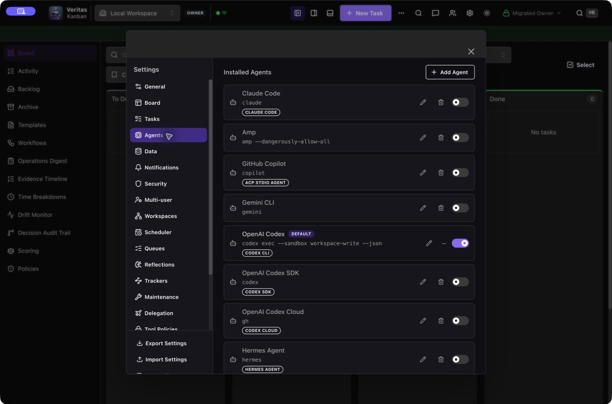
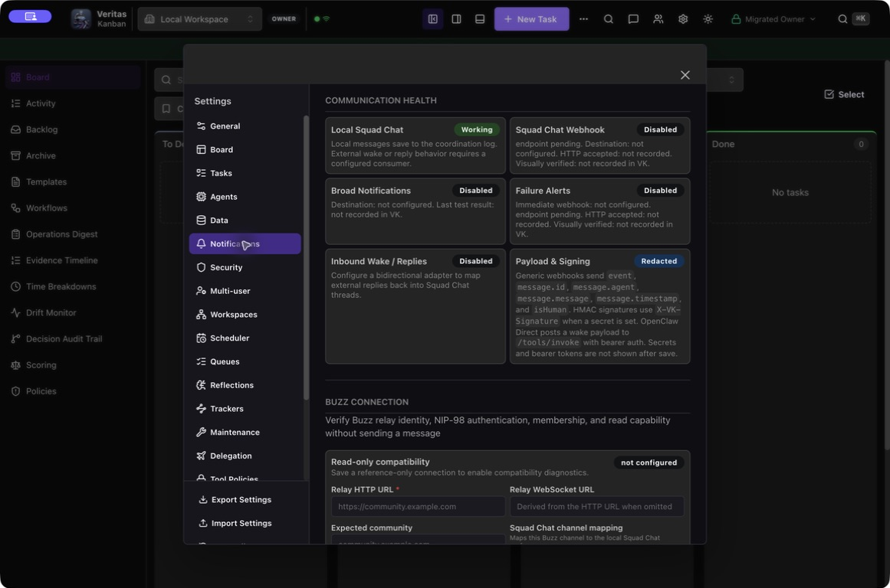
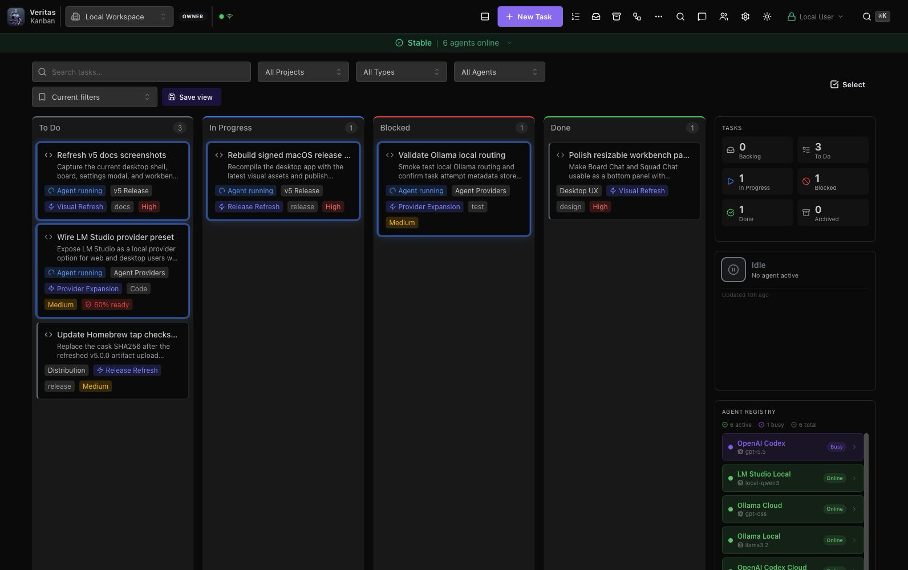
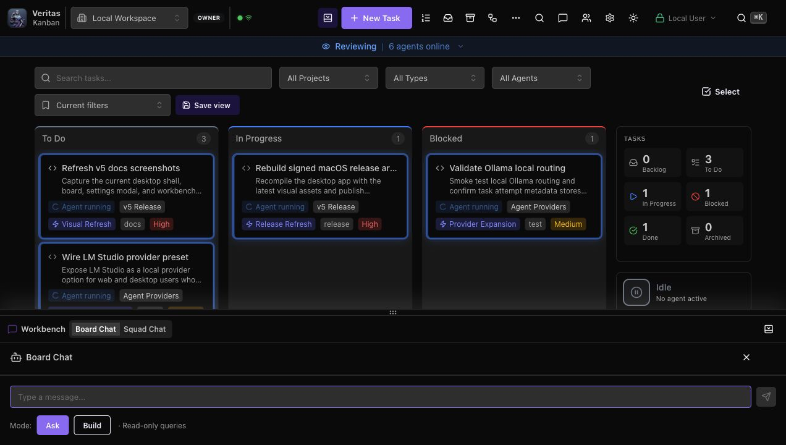
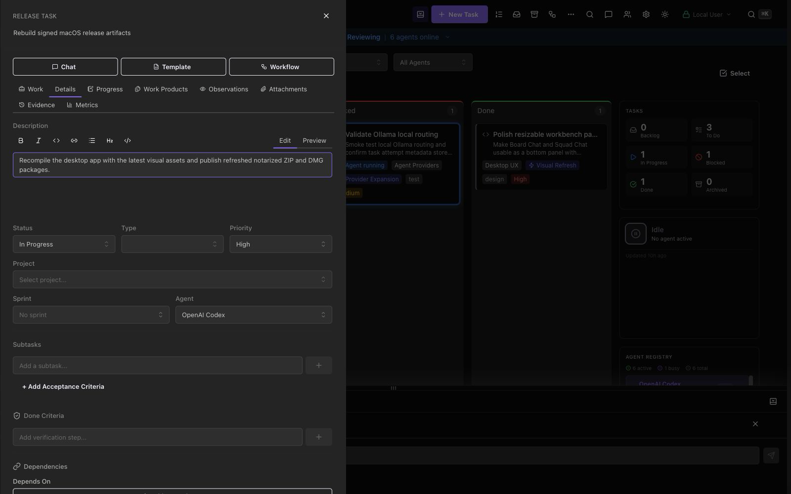

# Veritas Kanban v6 Visual Tour

This tour points to release-safe v6 runtime views for provider support, Buzz
integration, approvals, and run evidence. The general board, desktop shell,
Workbench, Squad Chat, Maintenance, and mobile/PWA layouts remain represented
by the retained [v5 Visual Tour](V5-VISUAL-TOUR.md) and its dummy-data assets.

Documentation freshness: 2026-07-24 for Veritas Kanban 6.0.0.

## Provider Support

Settings -> Agents shows the normalized support tier, installed version/build,
configuration readiness, certification freshness, limitations, and
remediation from the same `harness-support-profile/v1` and
`harness-compatibility-matrix/v1` records used by `vk doctor --json`, API
diagnostics, dispatch, and telemetry.

The release capture must use dummy profile names and contain no login state,
environment values, provider output, private paths, or credentials.

Expected visible behavior:

- Buzz, Grok Build, Codex app-server, Claude Code, and GitHub Copilot CLI show
  their reviewed exact build and source-availability caveat.
- Disabled installed profiles read Detected rather than Certified.
- Stale/unknown builds read Degraded or Unsupported with an actionable reason.
- Provider controls unsupported by the current manifest are not presented as
  silently available.

## Buzz Integration

Settings -> Notifications -> Buzz Connection keeps relay communication
separate from Buzz Agent execution. The connection view exposes reference-only
URLs, public identity, environment-variable references, compatibility facets,
one-channel mappings, definition preview/import, trigger rules, and bounded
audit state.

Expected visible behavior:

- private keys and auth tags appear only as environment reference names;
- compatibility failure disables delivery;
- persona/team import is preview-first and creates disabled objects;
- workflow triggers accept root `message.posted` only;
- replay, reply, edit, delete, reaction, echo, and disabled-rule dispositions
  are visible without launching duplicate workflow runs.

## Approval And Run Evidence

Task Detail and shared-run views project the causal `run-event/v1` journal,
exact-action approval requests, conversation lifecycle controls, tool/MCP
evidence, worktree/launch identity, usage, artifacts, and authoritative
completion result.

No public-safe approval was active in the isolated release profile. The text
contract below is retained instead of fabricating a passing approval state.

Expected visible behavior:

- approval copy identifies the exact action and risk without showing secret
  values;
- stale, expired, changed, cancelled, or already-decided requests cannot be
  approved;
- resume, steer, fork, compact, archive, interrupt, and close appear only when
  current provider evidence supports them;
- reconnect replays causal events by cursor without duplicating completion;
- mobile-safe questions remain separate from filesystem, command, network,
  permission, and MCP approval.

## Retained v5 Shell Views

The v6 harness work does not replace the established board, desktop shell,
Workbench, Squad Chat, Maintenance, or mobile/PWA layout. These release-safe
dummy captures remain applicable:

| Surface                            | Retained capture                                                 |
| ---------------------------------- | ---------------------------------------------------------------- |
| Board to workflow                  |          |
| Desktop shell                      |                  |
| Agent provider settings foundation |      |
| Workbench                          |                    |
| Squad Chat                         |  |
| Task work view                     |                |
| Maintenance                        |               |

## Capture Rules

Before publication, retain only verified v6 screenshots captured from an
isolated runtime without private data. If a state cannot be safely produced,
retain the text contract and record the missing visual evidence in the release
packet rather than fabricating a screenshot.

Capture desktop dark/light and compact widths where the state materially
changes. Verify keyboard focus, labels, contrast, and recoverable error copy.
Never capture credentials, private provider conversations, relay events,
tokens, local user paths, or unrestricted diagnostics.
