# Veritas Kanban v6 Visual Tour

This tour presents release-safe 6.1.5 views of the board, progressive task
workspace, grouped Settings, provider support, communication surfaces,
Maintenance, Command+K, Workbench, and mobile layout. The historical
[v5 Visual Tour](V5-VISUAL-TOUR.md) retains its own versioned media.

Documentation freshness: 2026-09-03 for the Veritas Kanban 6.1.5 release
candidate. Every image below was generated from the integrated 6.1.5 source
with isolated dummy data.

## Board And Task Workspace

The board uses the current semantic column states, compact task cards, shared
desktop shell, and Workbench affordance. Opening a task replaces the former
peer-tab drawer with progressive Overview, Plan, Run, Results, and History
modes.

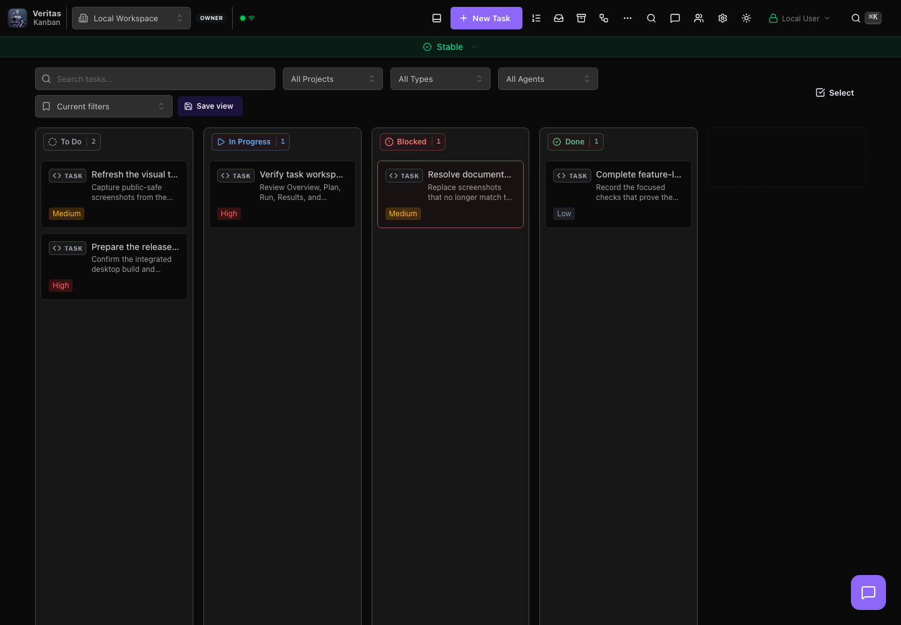

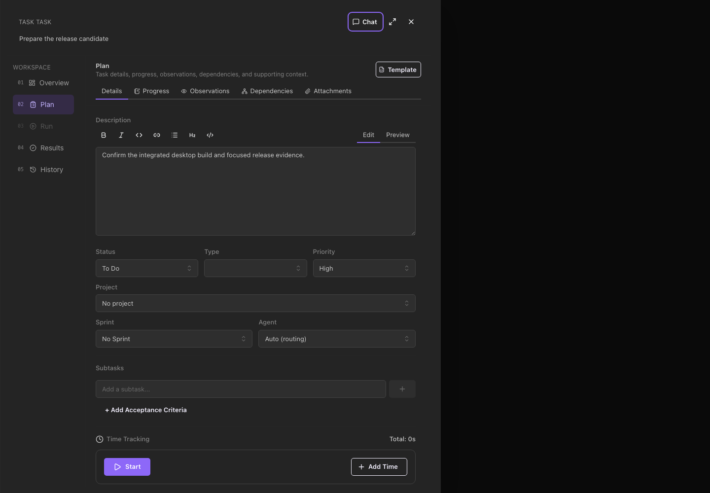

## Grouped Settings And Command Palette

Settings groups all twenty destinations under Core, Collaboration, Automation,
Governance, and System while keeping transfer and danger-zone actions separate.
Command+K uses the same current shell and remains bounded to the viewport.

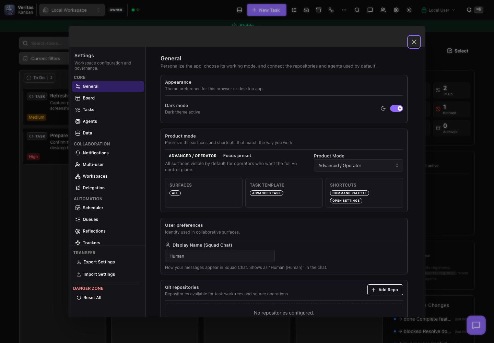

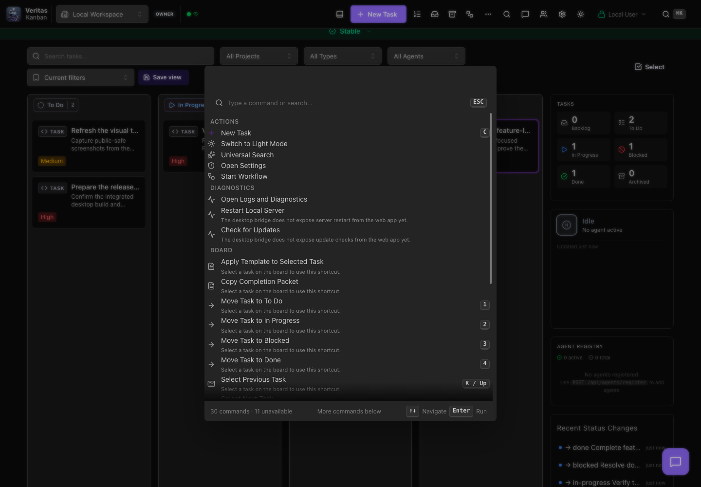

## Provider Support

Settings -> Agents shows the normalized support tier, installed version/build,
configuration readiness, certification freshness, limitations, and
remediation from the same `harness-support-profile/v1` and
`harness-compatibility-matrix/v1` records used by `vk doctor --json`, API
diagnostics, dispatch, and telemetry.

The release capture must use dummy profile names and contain no login state,
environment values, provider output, private paths, or credentials.

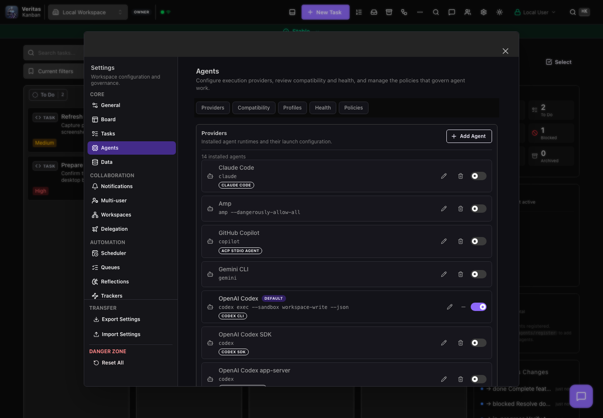

Expected visible behavior:

- Buzz, Grok Build, Codex app-server, Claude Code, and GitHub Copilot CLI show
  their reviewed exact build and source-availability caveat.
- Disabled installed profiles read Detected rather than Certified.
- Stale/unknown builds read Degraded or Unsupported with an actionable reason.
- Provider controls unsupported by the current manifest are not presented as
  silently available.

## Buzz Integration

Settings -> Notifications -> Buzz Connection keeps relay communication
separate from Buzz Agent execution. The connection view exposes reference-only
URLs, public identity, environment-variable references, compatibility facets,
one-channel mappings, definition preview/import, trigger rules, and bounded
audit state.

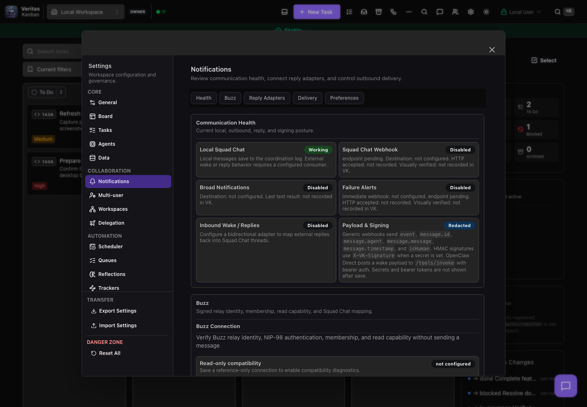

Expected visible behavior:

- private keys and auth tags appear only as environment reference names;
- compatibility failure disables delivery;
- persona/team import is preview-first and creates disabled objects;
- workflow triggers accept root `message.posted` only;
- replay, reply, edit, delete, reaction, echo, and disabled-rule dispositions
  are visible without launching duplicate workflow runs.

## Approval And Run Evidence

Task Detail and shared-run views project the causal `run-event/v1` journal,
exact-action approval requests, conversation lifecycle controls, tool/MCP
evidence, worktree/launch identity, usage, artifacts, and authoritative
completion result.

No public-safe approval was active in the isolated release profile. The text
contract below is retained instead of fabricating a passing approval state.

Expected visible behavior:

- approval copy identifies the exact action and risk without showing secret
  values;
- stale, expired, changed, cancelled, or already-decided requests cannot be
  approved;
- resume, steer, fork, compact, archive, interrupt, and close appear only when
  current provider evidence supports them;
- reconnect replays causal events by cursor without duplicating completion;
- mobile-safe questions remain separate from filesystem, command, network,
  permission, and MCP approval.

## Workbench, Squad Chat, Maintenance, And Mobile

| Surface            | Current 6.1.5 capture                                             |
| ------------------ | ----------------------------------------------------------------- |
| Workbench          | 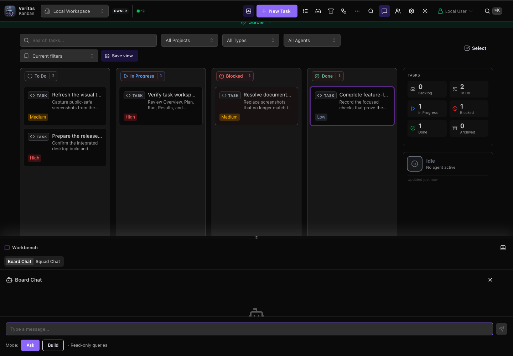                   |
| Squad Chat         | 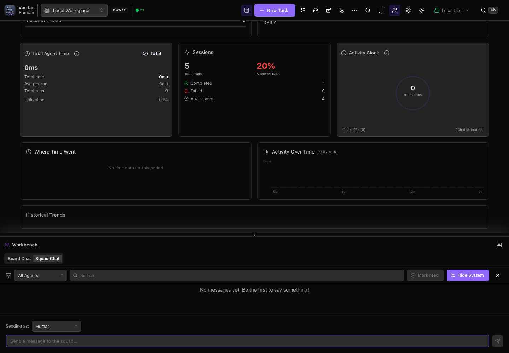                       |
| Maintenance        | 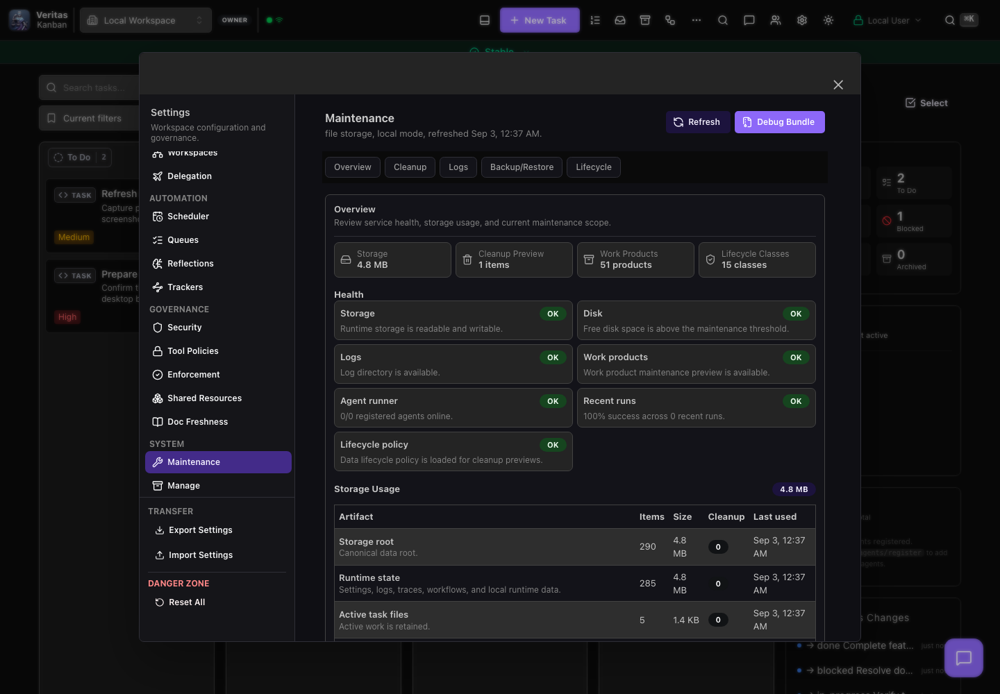              |
| Mobile board       |                    |
| Mobile task        | 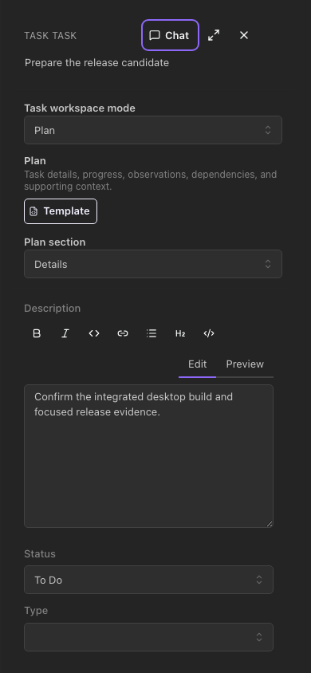 |
| Mobile Settings    | 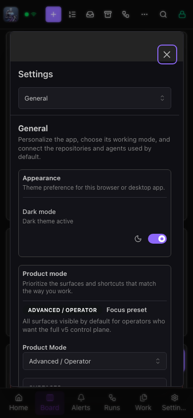             |
| Mobile guided tour | 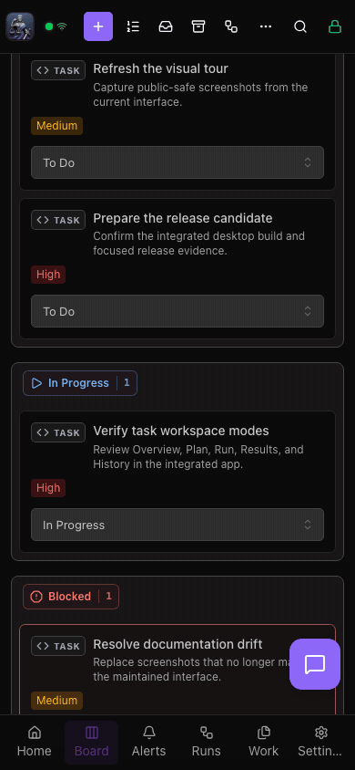                     |

## Capture Rules

Run `pnpm docs:capture-media` to recreate the maintained 6.1.5 PNG and GIF set
from an isolated Playwright runtime. The capture uses public dummy tasks,
cleans them after the run, and builds the GIFs from the reviewed screenshots.
It requires `ffmpeg` on `PATH`.

Before publication, retain only verified screenshots captured from an isolated
runtime without private data. If a state cannot be safely produced, retain the
text contract and record the missing visual evidence in the release packet
rather than fabricating a screenshot.

Capture desktop dark/light and compact widths where the state materially
changes. Verify keyboard focus, labels, contrast, and recoverable error copy.
Never capture credentials, private provider conversations, relay events,
tokens, local user paths, or unrestricted diagnostics.
